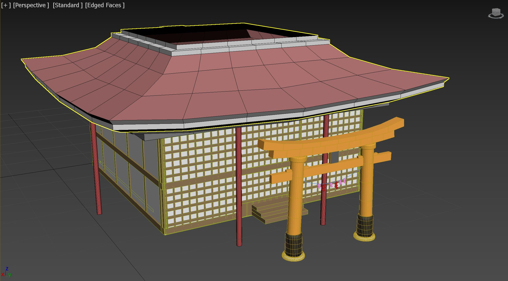
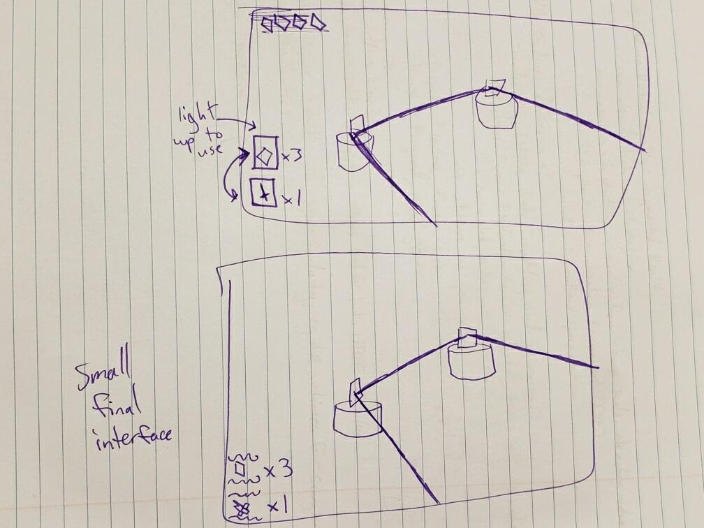
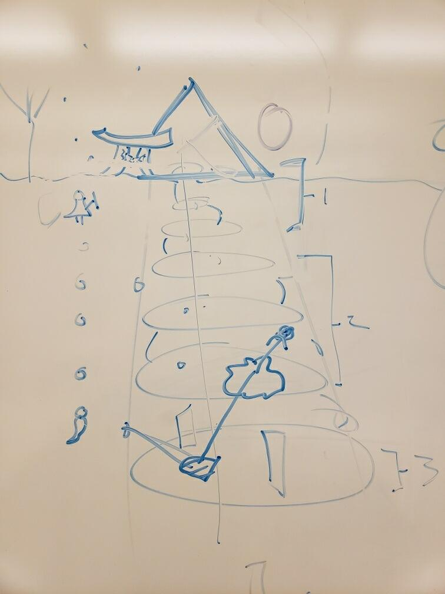
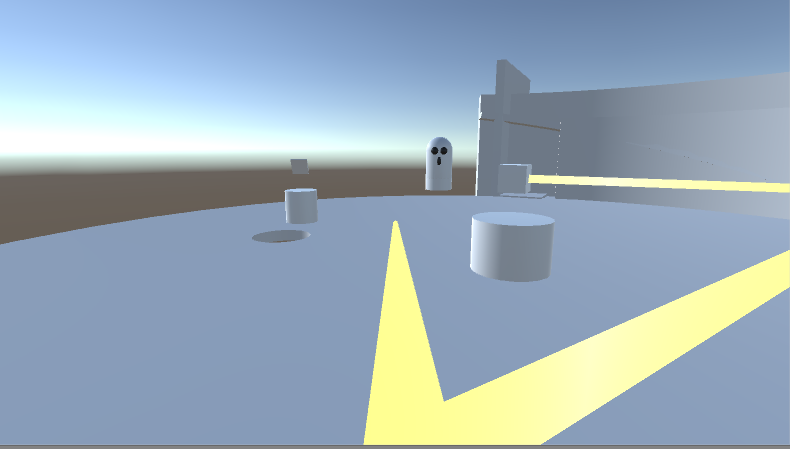
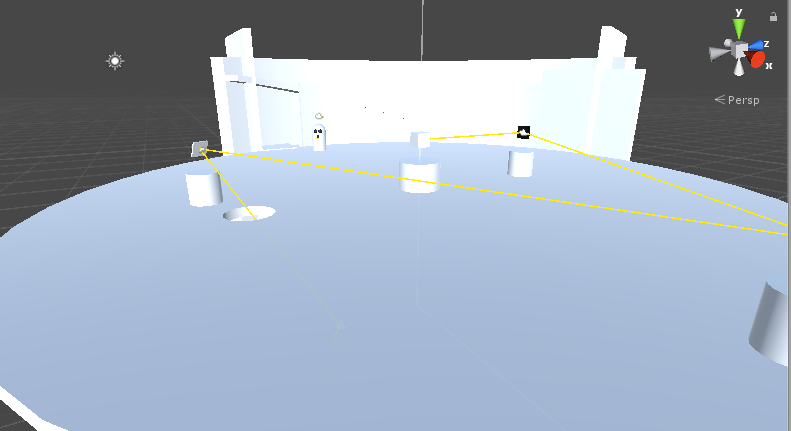

# Process

## Game Sounds and Music - 12/3/19
### General
- MP3 and WAV files from OpenGameArt.org
### Player Sounds
- Sword clang upon light reflection
- Footsteps (for snow and stone)
- Grunt when hurt by ghost
### Enemy Sounds
- Ghostly noises (hissing/laugher/moaning)
### Global Elements
- Ambient outdoor and indoor tracks
- Glass shattering
- Floor breaking
- Door opening (wooden and sliding)
- Placing/Taking pedestal objects
- Activating crystal switch
- Puzzle solution sound

## Level Design and Future Graphics
Over break, we will focus on getting our samurai modelled and rigged to put into our game. We also want to keep working on our models for the different types of ghosts. The core mechanics are starting to come together and the scripts will be more refined to improved gameflow. During the break more levels will be prototyped to test out puzzle designs and mechanics. Now that our control interfaces have been established, we'll be able to start building up our base scenes into funcitoning levels.

## Progress Update - 11/19/19
We've begun implementing our core mechanics and user interface to control objects within the game. The interface for our game is very simple, consisting of a central crosshair (to know where the player is looking) and some icons in the corner which display the number of mirror shards they have, along with the respective buttons for using the mirrors/sword. At this point the mirrors reflect the light beam and their rotation can also be set using our new interface. Clicking on the mirror enters edit mode, where the WASD keys are used to control the mirror's orientation. The ghosts' AI and behavior has also been programmed so that they follow the player whenever they are in sight and in range. Using the right mouse button, the player can even reflect the beam of light using their sword if the light is coming towards them. This can then be used to destroy the ghosts by reflecting the light at them. When a ghost dies, it instantiates an empty mirror pedestal, which can be grabbed and moved using the left mouse button. Using the OnMouseOver function in Unity we'll also have some user feedback which relays to the player what game object are interactable by changing their material color or giving them a slight glow.

We also have our map built out. We have multiple models of our map floor with the hole for light in different places so we can switch up flooring during development. We have prefabs of walls and stairs that can be chained together to form our levels 1-3, including our lowest and last floor with the larger mirrors and game ending. 

The beginning of the game includes the outside environment and level 0, the "tutorial level". The shrine for this level is fully designed and modeled with a hole in the shrine's ceiling for the first light interaction with the player. Adding this shrine to the chained floor prefabs will give us our entire game map; we can now fully design levels with the map in place. 

## Character
11/04/2019  
## Physical Traits
* disheveled/broken equipment
* samurai armor-wearing
* masked male human
* averagely proportioned 
* normal human movement slowly transforming into translucent model and ghostly movement
## Character Traits
* Responsible- throughout his life, the samurai tried to be fair to others and help those who are good
* Loyal- he had great friends throughout life and would go to great lengths to help them, though he wasn't always successful
## Backstory
The main character of Ghost Light, who the player controls, is an old samurai that has fallen in battle and is on a journey to the afterlife. He lived quite a long life, and experienced many battles watching his friends die each and every time. Because he's outlived everybody that fought by his side in his very first battle, he feels like he has failed each and every one of them, and so throughout his journey to the afterlife, he becomes consumed by guilt, and has to face his mental ghosts of the past and everybody who he thinks he's failed. Being so old, and having been injured while dying in battle, he moves slowly, and can't actually outrun any of the ghosts. 

## Values and Core Mechanics
10/30/2019  
### Values
* Descending
* Death
* Reflection
* Light Rays
* Continuation
### Core Mechanic
Place mirror shards on pedestals to reflect rays of light in specific places to solve a puzzle.

## Initial Brainstorming
10/28/2019  

Ghost Light is a game about a lone samurai exploring the ruins of an ancient temple. Evil spirits haunt the grounds and the samurai can only defeat them using reflected light, rendering his once trusty sword useless against these spectral foes. The original concept was more combat oriented, and involved fighting other samurai within a mirror maze, but for this game, we felt it would be more engaging to implement puzzles revolving around the use of mirrors and light rays to uncover secrets and pathways hidden throughout the temple (the core mechanic). We also want the game's overall aesthetic to reflect the architectural and mythological tropes of Shinto temples.
